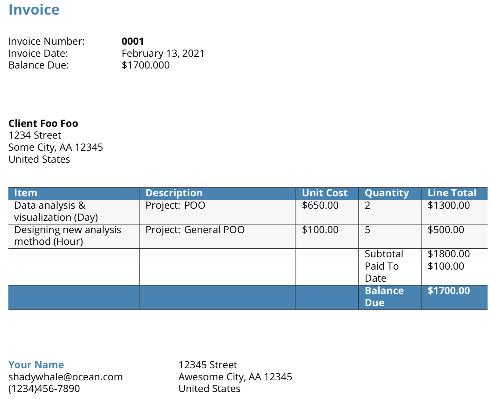

# invoiceR

An R Markdown based invoicing system that (1) creates a PDF invoice and (2) input billed balance into an income csv file. 

## Demo

* Run `demo/ClientName_InvoiceGeneration.Rmd` for a demo that will generate PDF invoice and export a csv file with income data. 
* If it is run again, the same invoice will be generated, but income data will not be exported unless the invoice number is different (try changing the `invoice_demo.yaml` file) 
* 

## Inputs
`invoiceR` wants 3 `yaml` files that separately define information for the (1) client, (2) provider (you), (3) invoice. 

* Information for client and provider includes names, addresses, phone/email that you will want to appear on the invoice. 
* Specific fields for invoice yaml file: 
	+ `nvoice_number` recommened to use <YEAR><4-digit-reset-each-year>. e.g., the first invoice in 2021 would have an invoice number of 20210001. 
	+ `line_items`: task performed
	+ `item_descrip`: description of task (treat this as a note section)
	+ `unit_cost`: how much is charged for each task
	+ `quantity`: how many times was this task performed 
	+ `paid_to_date`: how much has been paid for this invoice so far (usually it's zero) 

## Outputs
The PDF invoice will include the following:

* Client info (e.g., name, address) from client yaml file 
* Provider info (e.g., name, address, phone, email) from provider yaml file
* Everything from the invoice yaml file
* **Subtotal** is calculated based on  (`sum(unit_cost * quantity)`)
* **Balance Due** is calculated based on `sub_total`-`paid_to_date`

The CSV file includes: 

* `Date`: When this data was entered 
* `InvoiceNumber`: Invoice number from invoice yaml file
* `Balance`: **Balance Due** calcualted from data in invoice yaml file. 
* **NOTES:** If a new income_file is defined in the function, it will generate a new csv file with the above information entered. If an existing income_file is defined, it will check whether a duplicated invoice number exists. If yes, it will not enter the income data and ask you to either (1) define a new income_file or (2) set the income_file to `NULL` and skip this step. Set to `NULL` if re-generating PDF only. 

## Example

